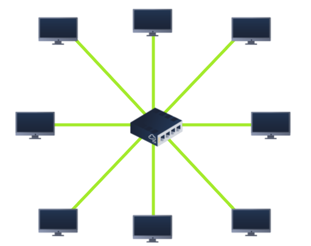
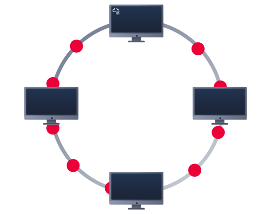

# Local area network (LAN) topologies
## Star topology

- Các thiết bị kết nối thông qua switch/hub. Mọi thông tin đc gửi đến thiết bị sẽ đi qua central device.
- Pros:
	+ Easy to add more devices
- Cons:
	+ More cabling, networking equipment => expensive.
	+ The more network scale, the more maintenance.
	+ If the central device fails, các thiết bị k thể nhận gửi info nữa.

## Bus topology

- Dựa trên kết nối duy nhất (backbone cable). 
- Pros: easy to set up and cost-efficent.
- Cons:
	+ Vì all data truyền dọc trên same cable, dễ bị chậm và tắc nghẽn (bottlenecked) nếu có nhiều thiết bị cùng yêu cầu data cùng 1 thời điểm.
	+ Khó xác định thiết bị nào gặp vấn đề vì data all travelling along the same route.
	+ If this cable were to break, devices no longer receive or transmit data along the bus.

## Ring topology (token topology)

- Các thiết bị kết nối trực tiếp vs nhau tạo thành loop. Data is sending across the loop until it reaches the destined device. 
- Pros: cần ít cáp, ít phụ thuộc vào dedicated hardware (thiết bị phần cứng chuyên dụng - hub/switch) như star topology.
- Cons:
	+ It may have to visit many multiple devices before end.
	+ Bottleneck like bus topology.
	+ Đứt cáp (cut cable) or one broken device => entire networking breaking.

## Switch - bộ chuyển mạch
- Kết nối các thiết bị **(connect devices)** với nhau trong mạng ethernet. Các thiết bị cắm vào switch's port.
- Switch cũng thường đc thấy ở các large network như doanh nghiệp, trường, bệnh viện...
- Switch hiệu quả hơn hub/repeater. Switch giữ 1 bảng các thiết bị kết nối đến port nào, nên khi nhận data -> chuyển tiếp ngay đến thiết bị đó, reducing network traffic.

- Switch và Router có thể kết nối với nhau -> tạo ra nhiều đường dẫn chuyền tin. Tuy nhiên sẽ bị chậm.

## Router
- Kết nối các mạng **(connect networks)** and pass data between them bằng Routing.
- Routing tạo ra các path between network. 

# Subnetting
