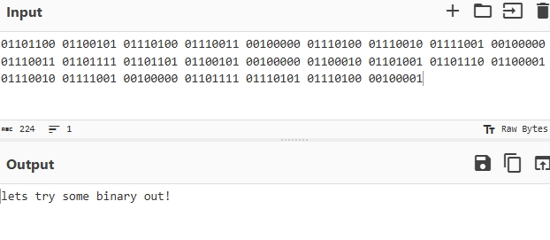

TryHackMe's **c4ptur3-th3-fl4g** is the easy-level room to practice decoding messages, analyzing a spectrogram, steganography. This writeup will go cover everything required to complete the room. 

I will provide detailed knowledge about each topic and the tools I used to solve the challenges.

# Task 1: Translation & Shifting
#### 1. Message One
We can easily know the answer of the encoded message because it simply converts some letters with numbers.
4 - A, 0 - O, 7 - T, 2 - R, 3 - E, 1 - L, 9 - G

| Answer: can you capture the flag?

#### 2. Message Two
The message is made up of 0s and 1s, we know that it's binary. And I will using [CyberChef](https://cyberchef.org/) to translate it. Plugging into CyberChef and using the "From Binary" recipe we can get the decoded message.

#### 3. Message Three
The message is made of the captial case alphabets and lots of = in end. So it seems Base32
